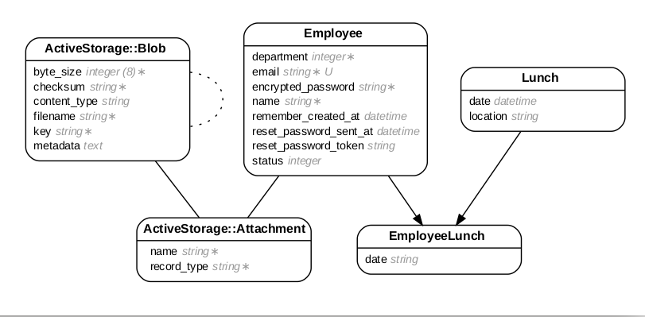

# README

[](https://codeclimate.com/repos/5f6b62fc69742d5923001307/maintainability) [](https://codeclimate.com/repos/5f6b62fc69742d5923001307/test_coverage) 


## Setup

Being a standard Ruby on Rails application, follow the usual steps to run it:

### Method 1

Clone repo, bundle install, configure db, run tests (rspec) then start server, app will be served on localhost:3000

```
$ git clone git@github.com:Cafrecode/mystery-lunch-creditshelf.git
$ cd mystery-lunch-creditshelf
$ bundle install
$ rails db:create db:migrate db:seed
$ rspec
$ rails s

```

### Method 2: docker-compose

```
$ git clone git@github.com:Cafrecode/mystery-lunch-creditshelf.git
$ cd mystery-lunch-creditshelf
$ sudo docker-compose up -d web jobs

```

The live demo site is available [here](https://mystery.cafrecode.co.ke)

### Misc

Once the server is up, you can initialize the initial lunch partner matching in one of the following ways:

1. To run immediately:
```
$ rails c
> EmployeeMatchingJob.perform_now

```

2. To schedule monthly runs:
```
$ whenever --update-crontab

```
The app uses the `whenever` gem to schedule the monthly recurring matching job.

# Mystery Matcher

The application's domain model is shown below. A good amount of the match selection is handled by the `Employee` model directly, while the other two namely `Lunch` and `EmployeeLunch` provide a decent way of keeping track of matched partners.



For two employees, the matching is accomplished by the following outlined behaviours and attributes of the `Employee` model to satisfy the criteria:

1. `is_available`: Returns true if the employee is in an `active` state and has not been paired up for lunch in the current month.
2. `is_compatible`: Checks for any matches within the last three months between any two employees and returns true if none exists.
3. `get_mystery_match`: Suggests a random employee that meets the matching criteria.
4. `match`: Assigns two employees to a scheduled `Lunch`

When a new employee is created, the `after_create` callback selects a matching strategy that will assign the new employee to a party of three from different departments.

Deleting an employee changes their status, preserves their matches from previous months but releases their lunches for the current month, with a callback after commiting either rematching their freed partner to a different group or retaining their partners if two exist.

While the matching should work in most cases, some instances might leave un matched employees for instance when there are only 3 employees from the same department is something similar.

### Some extra features:

1. Employees are notified via email once matches are made
2. Employees can either browse anonymously to view matches or create accounts and sign in to be able to add employees. Even though there were plans to restrict access to the employee management to only employees in the HR dept, the plans were shelved to ease interaction flexibility.
3. When an employee is created, an auto generated password is emailed to them. They can also self-register.
4. Images are uploaded to AWS and are available via CDN.

#### Other

* When editing employees, verify the department selected is the right one as the drop down seems to always default to the first one.
* Filtering by department on the home page is not strictly implemented yet.


